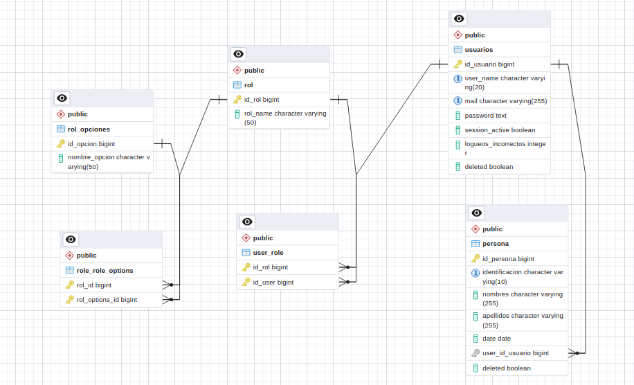

## Prueba Viamatica

Al iniciar el proyecto los entidades de la base de datos son creadas automaticamnete, gracias a hibernate.

### Tomar en cuenta
El proyecto cada vez que se reinicia borra todas las entidades de la base de datos
Si queremos que este comportamiento no pase cambiar el valor de la propiedad ```spring.jpa.hibernate.ddl-auto``` a ```pring.jpa.hibernate.ddl-auto=update```  
Una vez de correr el proyecto por primera vez comentar la propieda: ```spring.sql.init.mode=always``` 

### Credenciales
Cuando iniciamos el proyecto se crea un usario para podernos authenticar, estas son las credenciales:
```
username: Anderk2222 or anderk222@gmail.com
contrasena: pass
```

### Documentacion
Documentacion **SWAGGER** ```localhost:8080/swagger-ui/index.html#/``` Apenas entrar te pedira authenticacion.


Documentacion **POSTMAN**

```https://www.postman.com/planetary-meteor-951586/workspace/viamatica-prueba-anderson-macias/request/17302637-58b24696-15f7-4439-bda5-3a048c96060b```

### Base de Datos


### Observaciones
Los CRUD de roles y opciones roles no funionan, al momento de hacer las relaciones ManyToMany, las relaciones no estan siendo guardadas en la base de datos,
para mi vista las entidades con estas relaciones estan bien mapeadas, llego la cegera 🥲.
